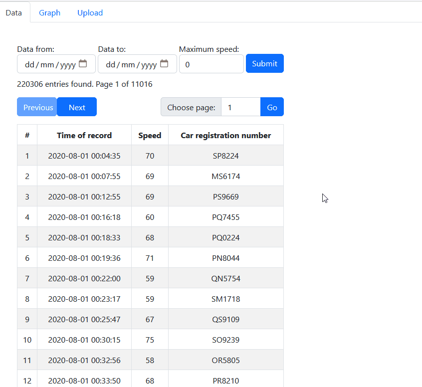
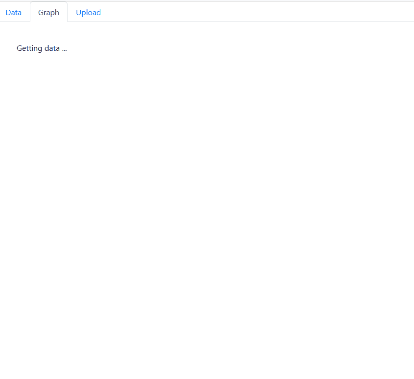
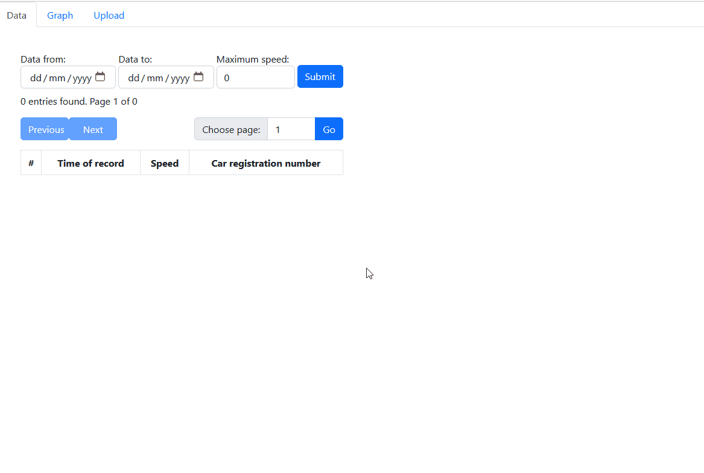

  <b> Filter Page </b> 
  

  <b> Graph Page </b> 
  

  <b> Upload Page </b> 
  

# CarSpeedReview

Author: Edgars Berzins

## About

CarSpeedReview is a project designed for loading and reviewing statistics related to the number of cars and their average speed on a specific road segment. Users can select records based on specific criteria and view the average speed of cars in a graphical format for a single day.
Functionality

## The CarSpeedReview system provides the following features:

1. **Loading statistics data for a month**: Users can upload a .txt file containing statistics data, including the date, speed, and car registration number separated by a TAB character.
2. **Selecting and filtering statistics data**: Users can select and view statistics data in a tabular format, displaying the date, speed, and car registration number. The data can be filtered based on speed, date range, or a combination of both. Up to 20 rows are displayed at a time.
3. **Viewing average speed graph**: Users can choose a specific day of the month to display the average speed graph. The graph shows the average speed throughout the day, with a one-hour interval.

## Installation and Setup Instructions

To run the CarSpeedReview project, please follow the steps below:

- Download the project repository.
- Build the project.
- Ensure you have the following dependencies installed on your system:
  - [Node.js](https://nodejs.org)
  - [.NET SDK](https://dotnet.microsoft.com/download)
- The AWS RDS MySQL database has already been configured. Make sure to update the necessary connection details in the appsettings.json file of the .NET Web API project.
- Start the CarSpeedReview application by executing the startAPI.bat file, which will launch both the React app and the .NET Web API.

## Problems

During the development process, the author encountered the following problem:

- Loading times: The loading of large data sets can sometimes result in slower performance.

## Potential Future Improvements

The following are potential future improvements for the CarSpeedReview project:

- Implementing tests in both the Web API and React components to ensure the stability and reliability of the system.
- Deploying the application on online services or cloud platforms to make it accessible to a wider audience.
- Customizing and enhancing the React components to improve the user interface and user experience.

## Additional Comments

A Web API controller has been implemented that allows deleting the entire database. Exercise caution when using this functionality as it permanently removes all data.
